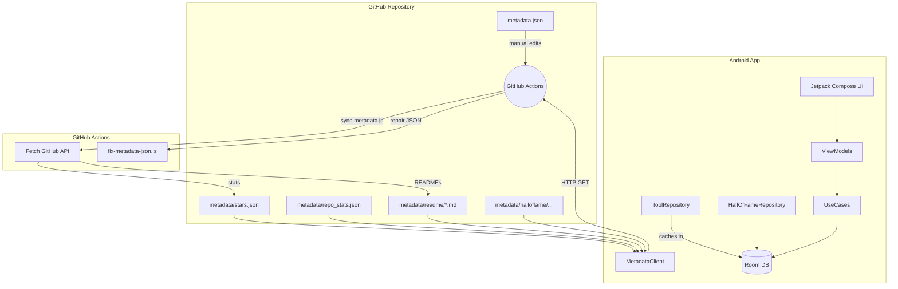

# How TermuxHub Data Pipeline Works

This document explains the end-to-end data pipeline of **TermuxHub** — from metadata management on GitHub to rendering tools in the Android app.

---

## Overview

TermuxHub aggregates information about Termux‑compatible tools from multiple GitHub repositories, enriches it with live statistics (stars, forks, issues, READMEs), and presents it in a modern Android app. The entire pipeline is automated via **GitHub Actions**, ensuring the metadata stays fresh with minimal manual intervention.

```
GitHub Repositories (source of truth)
        ↓
GitHub Actions (sync-metadata.js)
        ↓
metadata/*.json + metadata/readme/*.md
        ↓
Android App (fetches from GitHub raw)
        ↓
Room Database (local cache)
        ↓
ViewModels + UseCases
        ↓
Jetpack Compose UI
```

---

## 1. Data Entry – Where Tool Information Comes From

The source of truth for tool metadata is the `metadata/metadata.json` file in the repository. It is manually maintained (or can be generated by external scripts) and contains basic information for each tool:

- **id** – unique identifier (used for URLs and thumbnails)
- **name**, **description**, **category**
- **install** – installation command(s)
- **repo** – GitHub repository URL (e.g. `https://github.com/owner/repo`)
- **author**, **requireRoot**, **thumbnail**, **tags**, **publishedAt**

**Example entry:**

```json
{
  "id": "termux-api",
  "name": "Termux:API",
  "description": "Access Android API from command line",
  "category": "Utilities",
  "install": "pkg install termux-api",
  "repo": "https://github.com/termux/termux-api",
  "author": "termux",
  "requireRoot": false,
  "tags": ["api", "android"],
  "publishedAt": "2023-01-01"
}
```

---

## 2. Automation Pipeline – GitHub Actions

Two key workflows keep the metadata up‑to‑date:

### a) Metadata Synchronization (`metadata-sync.yml`)

**Triggers:**

- On push to `metadata/metadata.json`
- Daily at 00:00 UTC (scheduled)
- Manually via `workflow_dispatch`

**What it does:**

1. Runs `sync-metadata.js` (Node.js script).
2. Reads `metadata/metadata.json`.
3. For each tool, extracts the GitHub `owner` and `repo` from the `repo` field.
4. Fetches real‑time data from the **GitHub API**:
   - **Repository stats:** stars, forks, open issues, license, last push date.
   - **Pull request count** (open PRs).
   - **README content** (converted from base64, relative links rewritten to absolute, badges stripped, truncated if >100 KB).
5. Writes:
   - `metadata/stars.json` – map of tool id → star count.
   - `metadata/repo_stats.json` – map of tool id → `{forks, issues, pullRequests, license, lastUpdated}`.
   - `metadata/readme/{id}.md` – processed README for each tool.
6. Commits and pushes changes back to the repository (if any).

### b) Metadata JSON Guard (`metadata-json-guard.yml`)

**Triggers** on push to `metadata/metadata.json`.

- Runs `fix-metadata-json.js`, which uses `jsonc-parser` to repair malformed JSON (e.g. trailing commas, comments) and writes a canonical version.
- If changes were made, it creates a **pull request** with the fix, allowing a human to review and merge.

---

## 3. Repository Data Structure

After the sync workflow runs, the following files are available under the `metadata/` folder:

| File / Folder | Description |
|---|---|
| `metadata.json` | Core tool list (manually maintained). |
| `stars.json` | `{ "lastUpdated": "YYYY-MM-DD", "stars": { "tool-id": starCount, ... } }` |
| `repo_stats.json` | `{ "lastUpdated": "...", "stats": { "tool-id": { "forks", "issues", "pullRequests", "license", "lastUpdated" } } }` |
| `readme/{id}.md` | README file for each tool (stripped of badges, truncated if too large). |
| `thumbnail/{id}.webp` | Tool thumbnail images (manually uploaded, not auto‑generated). |
| `halloffame/index.json` | List of Hall of Fame members (manually maintained). |
| `halloffame/{id}.md` | Markdown description for each member. |

All files are served from GitHub's **raw CDN**, which the Android app consumes.

---

## 4. Android App – How Data Is Consumed

### a) Network Layer

The app uses a `MetadataClient` that builds a Retrofit instance pointing to:

```
https://raw.githubusercontent.com/maazm7d/TermuxHub/main/
```

Endpoints are defined in `ApiService`:

```kotlin
@GET("metadata/metadata.json")
suspend fun getMetadata(): Response<MetadataDto>

@GET("metadata/readme/{id}.md")
suspend fun getToolReadme(@Path("id") toolId: String): Response<String>

@GET("metadata/stars.json")
suspend fun getStars(): Response<StarsDto>

// ... similar for repo_stats, halloffame
```

### b) Local Database (Room)

The app caches all data locally to work offline and provide fast access. Two entities are used:

- **ToolEntity** – stores all tool details, plus the `readme` field (populated on demand).
- **HallOfFameEntity** – stores member info and contribution markdown.

### c) Repository Pattern

- **ToolRepositoryImpl** orchestrates fetching and caching:
  1. On app start, `SplashViewModel` calls `refreshFromRemote()`.
  2. Fetches `metadata.json`, `stars.json`, `repo_stats.json` from GitHub.
  3. Merges data into `ToolEntity` objects.
  4. Batch inserts into Room (using `insertAll`).
  5. Falls back to a bundled `assets/metadata/metadata.json` if network fails.
- **READMEs** are fetched lazily when a user opens a tool detail screen and are then stored in the database for future use.
- **HallOfFameRepository** similarly fetches the index and markdown files and caches them.

### d) Data Flow to UI

The app follows **MVVM with use cases**:

- **UseCases** (e.g. `GetToolsUseCase`) expose `Flow<List<Tool>>` from Room.
- **ViewModels** (e.g. `HomeViewModel`) collect the flows and expose state (e.g. `HomeUiState`) to the UI.
- **Jetpack Compose** screens observe the `StateFlow` and recompose when data changes.

---

## 5. UI Rendering Pipeline

### Home Screen (`HomeScreen`)

- Shows a list of tools with filtering (search, category) and sorting (newest/oldest, stars).
- Each `ToolCard` displays thumbnail, name, description, tags, and interactive buttons (save, share, star).
- Star counts are shown from the `starsMap` (fetched separately).
- Pull‑to‑refresh triggers a sync via `viewModel.refresh()`.

### Detail Screen (`ToolDetailScreen`)

- Loads a tool's full details via `GetToolDetailsUseCase`.
- If the README is not already cached, it is fetched on‑demand (and stored).
- Displays:
  - Thumbnail
  - Repository stats badges (stars, forks, issues, PRs, license, last update)
  - Markdown‑rendered README (using `multiplatform-markdown-renderer`)
  - Installation commands (copyable)
  - Buttons to open GitHub or report an issue

### Deep Linking

- The app supports `https://maazm7d.github.io/termuxhub/tool/{id}` links.
- `MainActivity` extracts the tool ID and navigates directly to the detail screen.

---

## 6. End‑to‑End Flow (Step‑by‑Step)

1. **Manual Metadata Update**
   A contributor edits `metadata/metadata.json` (e.g. adds a new tool) and pushes to the `main` branch.

2. **Automated Sync**
   - GitHub Actions trigger `metadata-sync.yml`.
   - `sync-metadata.js` reads the updated `metadata.json`.
   - For each tool, it calls the GitHub API to fetch current stats and README.
   - It writes `stars.json`, `repo_stats.json`, and individual `readme/{id}.md` files.

3. **Commit & Push**
   The bot commits any changes (new star counts, updated READMEs) back to the repository.

4. **App Startup**
   - The user opens TermuxHub.
   - `SplashScreen` launches, and `SplashViewModel` calls `refreshToolsUseCase`.
   - `ToolRepositoryImpl` attempts to fetch `metadata.json`, `stars.json`, `repo_stats.json` from GitHub raw.
   - If successful, it parses the DTOs, merges with existing database entries, and updates Room.
   - If offline, it falls back to the bundled asset.

5. **Home Screen**
   - `HomeViewModel` observes `getToolsUseCase` (a `Flow` from Room).
   - The UI receives a list of `Tool` domain objects and renders them with filters and sorting.

6. **Tool Details**
   - The user taps a tool card, navigating to `ToolDetailScreen` with the tool ID.
   - `ToolDetailViewModel` calls `getToolDetailsUseCase`.
   - If the README is missing in the database, it is fetched on‑demand and stored.
   - The screen displays the full information, including the rendered README.

---

## 7. Architecture Overview

TermuxHub uses a clean, modular architecture:

- **Data Layer**
  - `remote` – Retrofit + Moshi for network calls.
  - `local` – Room database with DAOs.
  - `repository` – Implementation of data sources, caching logic.
- **Domain Layer**
  - `model` – Plain Kotlin data classes.
  - `usecase` – Encapsulates business logic (e.g. fetching tools, toggling favorites).
  - `mapper` – Converts between Entity and Domain models.
- **Presentation Layer**
  - `ui` – Jetpack Compose screens and components.
  - `viewmodel` – State holders using `StateFlow`.
  - `navigation` – Compose navigation with bottom bar and deep links.
- **Dependency Injection**
  - Dagger Hilt is used throughout, with modules for data, repository, and use cases.

---

## Diagram: Complete Data Pipeline (Mermaid)



---

> This pipeline ensures that the TermuxHub app always shows the latest information from the original GitHub repositories, with minimal manual overhead.
